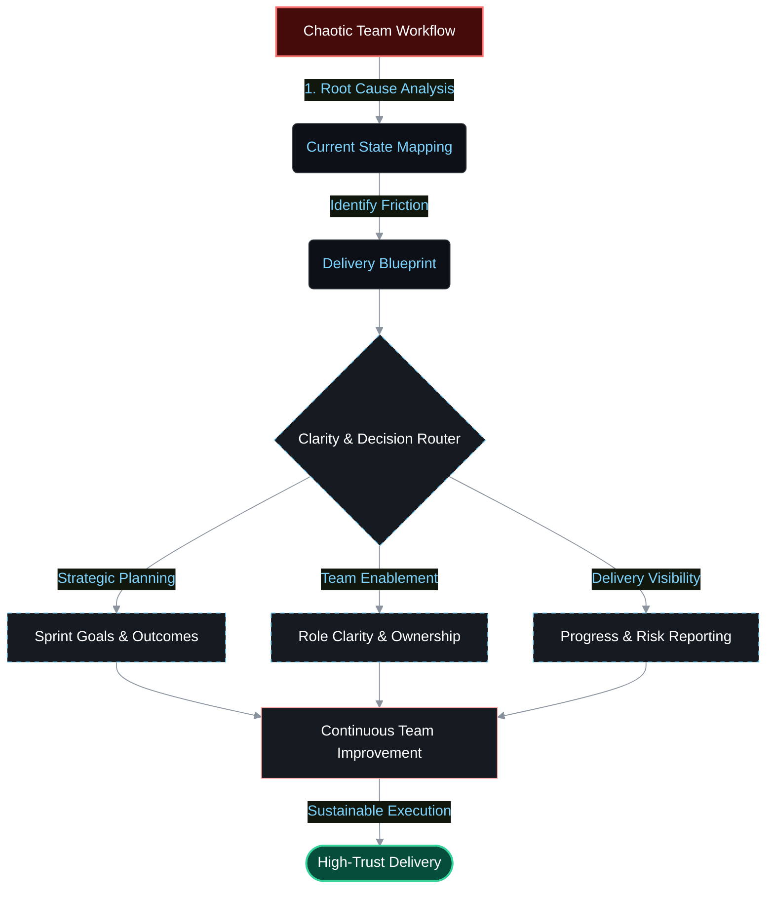
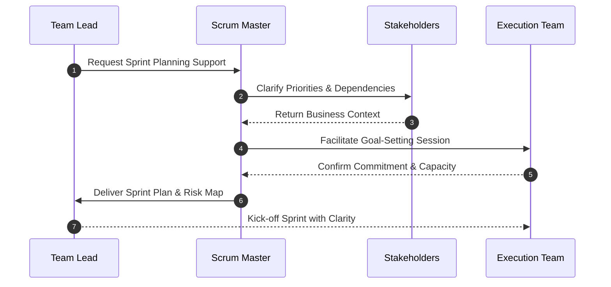
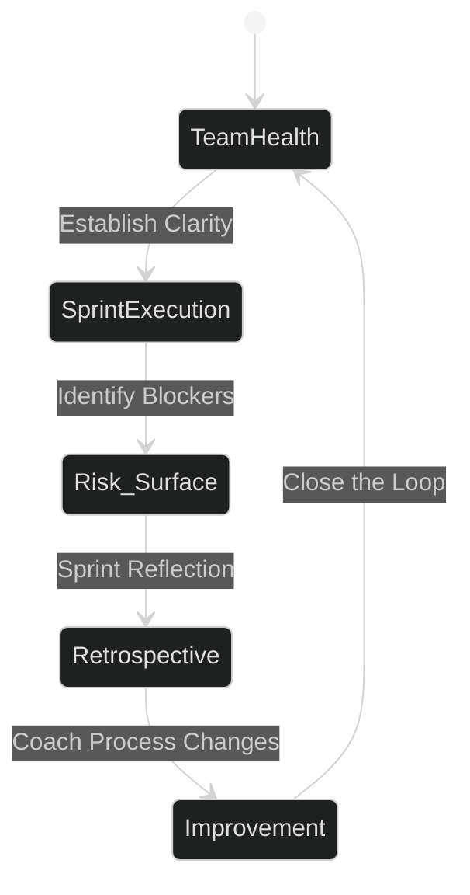
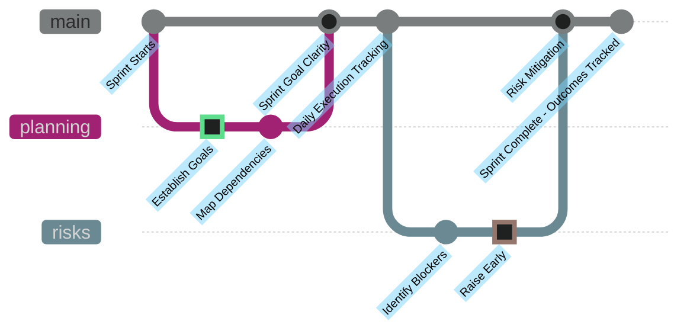

<!-- Hero Image -->

  

<!-- Simulated Terminal UI for Mission Statement -->
<table width="100%" style="border-collapse: collapse; border: 1px solid #30363d;">
  <tr style="background-color: #161b22; border-bottom: 1px solid #30363d;">
    <td align="left" style="padding: 8px 12px; font-family: monospace; color: #8b949e; font-size: 14px;">
      🔴 🟡 🟢 &nbsp; <b>deveninception@root:~#</b> ./deliver_clarity.sh
    </td>
  </tr>
  <tr style="background-color: #0d1117;">
    <td align="center" style="padding: 20px;">
      
    </td>
  </tr>
</table>

 

<!-- Bento Box Grid: Badges & Key Metrics -->
<table width="100%" style="border: none;">
  <tr>
    <!-- Badges Column -->
    <td width="30%" align="center" valign="middle">
        
        
      
    </td>
    <!-- Stats Column -->
    <td width="35%" align="center" valign="middle">
      
    </td>
    <!-- Focus Areas Column -->
    <td width="35%" align="center" valign="middle">
        
        
      
    </td>
  </tr>
</table>

---

## 🎯 The Delivery Engine

I bridge the gap between organizational strategy and team execution. Clarity is the foundation. Before a sprint is planned, I establish shared understanding of priorities, dependencies, and success metrics—ensuring every team member moves with confidence and visibility.

---

## 🏗️ Core Delivery Practice

Below are the key pillars of my delivery leadership methodology. Every principle is tested against real-world team dynamics and delivery outcomes.

 

### 🎯 Strategic Clarity & Planning

  
  
  

> **The Challenge:** Teams lack clear understanding of priorities, dependencies, and success criteria. Work starts without shared ownership or measurable goals.
> 
> **The Approach:** A structured planning framework that establishes shared visibility. Every sprint window has explicit goals, clear role ownership, and measurable outcomes. Dependencies are mapped early; risks are surfaced before they block execution.

 

### 👥 Team Enablement & Sustainable Pace

  
  
  

> **The Challenge:** Teams burn out because they lack process discipline, carry excessive context switching, or lack psychological safety to raise risks early.
> 
> **The Approach:** A coaching-based model that enables teams to improve without claiming their work. I facilitate retros, support retrospective actions, coach on estimation and planning, and create space for teams to talk about capacity and sustainable pace.

 

### 📊 Delivery Visibility & Reporting

  
  
  

> **The Challenge:** Leadership lacks actionable insight into team delivery. Status reports are disconnected from actual execution. Risk is hidden until it's too late to act.
> 
> **The Approach:** A transparent reporting model that connects activity to measurable outcomes. Every report shows goals, completion status, emerging risks, and blocked dependencies. Reports are tied to verifiable sources so they remain trustworthy and actionable.

---

## ⚙️ Delivery Leadership Stack

<table width="100%" style="border-collapse: collapse; border: 1px solid #30363d; background-color: #0d1117;">
  <tr style="background-color: #161b22; border-bottom: 1px solid #30363d;">
    <th align="center" style="padding: 15px; color: #7dd3fc; width: 33%;">Leadership Practice</th>
    <th align="center" style="padding: 15px; color: #7dd3fc; width: 34%;">Team Enablement</th>
    <th align="center" style="padding: 15px; color: #7dd3fc; width: 33%;">Delivery Outcomes</th>
  </tr>
  <tr>
    <!-- Col 1 -->
    <td align="center" valign="top" style="padding: 20px 10px; border-right: 1px solid #30363d;">
        
      <code>Strategic Planning</code> 
      <code>Sprint Facilitation</code> 
      <code>Dependency Mapping</code>
    </td>
    <!-- Col 2 -->
    <td align="center" valign="top" style="padding: 20px 10px; border-right: 1px solid #30363d;">
         
      <code>Coaching & Mentoring</code> 
      <code>Process Improvement</code> 
      <code>Psychological Safety</code>
    </td>
    <!-- Col 3 -->
    <td align="center" valign="top" style="padding: 20px 10px;">
         
      <code>Visibility & Reporting</code> 
      <code>Risk Management</code> 
      <code>Measurable Progress</code>
    </td>
  </tr>
</table>

---

  

  [ Execution with clarity. Delivery with visibility. ]

