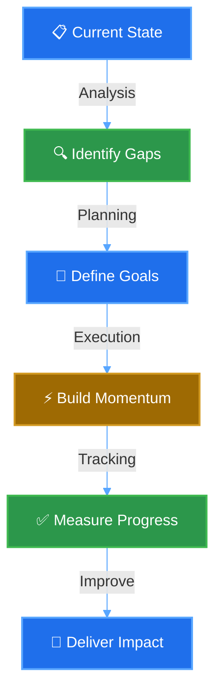
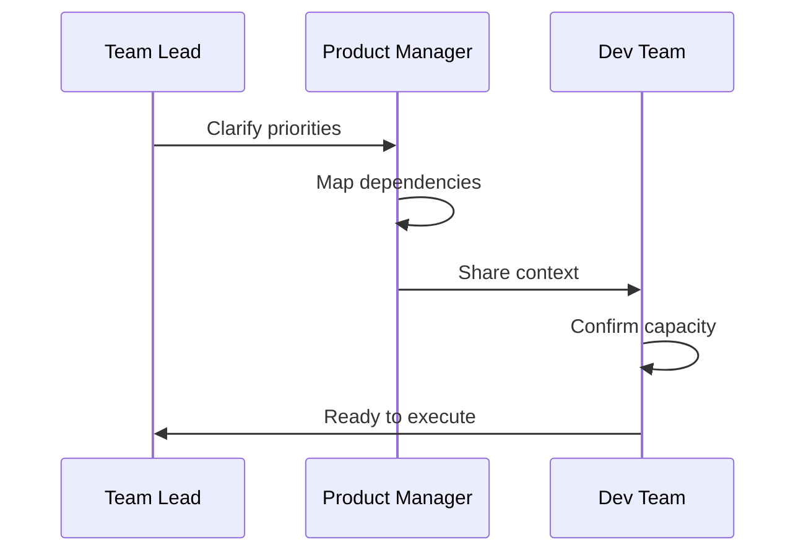
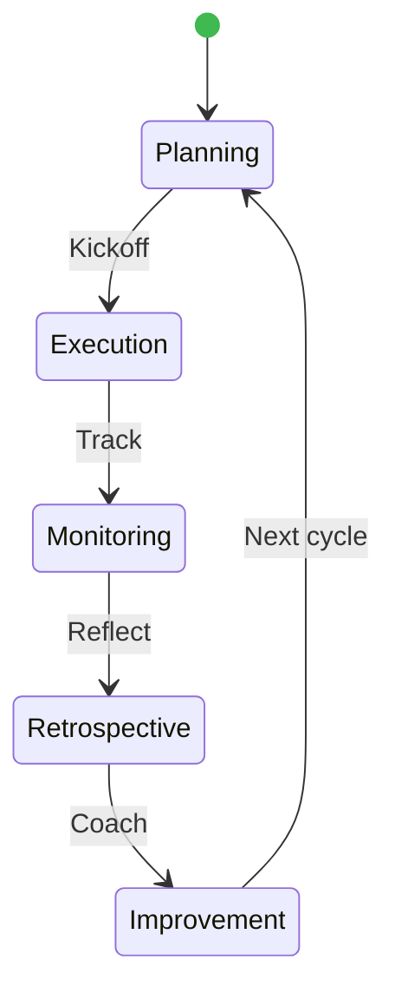

<!-- Hero Section -->
<h1 style="margin: 0; padding: 20px; font-size: 32px; background: linear-gradient(135deg, #0d1117 0%, #161b22 100%); color: #7dd3fc; font-weight: 700; letter-spacing: 1px;">
  🎯 DELIVERY LEADERSHIP
</h1>

  Strategic clarity • Team enablement • Measurable outcomes

 

## The Delivery Engine

I bridge organizational strategy and team execution through **structured clarity**. Every sprint begins with aligned understanding of priorities, dependencies, and measurable success criteria.

### The Flow

---

## 🏗️ Core Delivery Practice

### 🎯 Strategic Clarity & Planning

**The Challenge:** Teams start work without shared understanding of priorities, dependencies, or success criteria.

**The Approach:** Structured planning that establishes crystal-clear visibility before execution begins.

### 👥 Team Enablement & Sustainable Pace

**The Challenge:** Teams burn out from context switching, lack process discipline, and fear surfacing risks.

**The Approach:** Coaching-based improvement that builds psychological safety and sustainable velocity.

### 📊 Delivery Visibility & Reporting

**The Challenge:** Leadership lacks actionable insight into delivery. Risk is hidden until it's too late.

**The Approach:** Transparent reporting connecting activity to business outcomes in real-time.

<table width="100%" style="border-collapse: collapse; margin: 25px 0; background: #ffffff;">
  <tr style="background: linear-gradient(90deg, #238636 0%, #1f6feb 100%); border: none;">
    <th style="padding: 15px; color: white; font-weight: 600; font-size: 13px; text-align: center; border: none;">PHASE</th>
    <th style="padding: 15px; color: white; font-weight: 600; font-size: 13px; text-align: center; border: none;">STATUS</th>
    <th style="padding: 15px; color: white; font-weight: 600; font-size: 13px; text-align: center; border: none;">ACTION</th>
  </tr>
  <tr style="border-bottom: 1px solid #d0d7de;">
    <td style="padding: 15px; text-align: center; color: #0d1117; font-weight: 600;">📋 Goals Set</td>
    <td style="padding: 15px; text-align: center; color: #238636; font-weight: 600;">✅ Aligned</td>
    <td style="padding: 15px; text-align: center; color: #57606a; font-size: 13px;">Priorities clear, dependencies mapped</td>
  </tr>
  <tr style="border-bottom: 1px solid #d0d7de;">
    <td style="padding: 15px; text-align: center; color: #0d1117; font-weight: 600;">⚡ Execution</td>
    <td style="padding: 15px; text-align: center; color: #1f6feb; font-weight: 600;">🚀 In Progress</td>
    <td style="padding: 15px; text-align: center; color: #57606a; font-size: 13px;">Daily tracking, momentum building</td>
  </tr>
  <tr style="border-bottom: 1px solid #d0d7de;">
    <td style="padding: 15px; text-align: center; color: #0d1117; font-weight: 600;">⚠️ Risk Surface</td>
    <td style="padding: 15px; text-align: center; color: #d29922; font-weight: 600;">🔔 Alert</td>
    <td style="padding: 15px; text-align: center; color: #57606a; font-size: 13px;">Blockers identified, mitigation planned</td>
  </tr>
  <tr style="border-bottom: 1px solid #d0d7de;">
    <td style="padding: 15px; text-align: center; color: #0d1117; font-weight: 600;">✅ Resolution</td>
    <td style="padding: 15px; text-align: center; color: #238636; font-weight: 600;">✅ Unblocked</td>
    <td style="padding: 15px; text-align: center; color: #57606a; font-size: 13px;">Risk mitigated, execution resumes</td>
  </tr>
  <tr>
    <td style="padding: 15px; text-align: center; color: #0d1117; font-weight: 600;">🎯 Delivered</td>
    <td style="padding: 15px; text-align: center; color: #238636; font-weight: 600;">✨ Success</td>
    <td style="padding: 15px; text-align: center; color: #57606a; font-size: 13px;">Outcomes tracked, lessons captured</td>
  </tr>
</table>

---

## ⚙️ Leadership Practice Stack

<table width="100%" style="border-collapse: collapse; border: none; margin: 30px 0;">
  <tr style="background: linear-gradient(90deg, #1f6feb 0%, #238636 50%, #d29922 100%); border: none;">
    <th style="padding: 20px; color: #ffffff; font-weight: 600; font-size: 14px; text-align: center; border: none;">STRATEGIC PLANNING</th>
    <th style="padding: 20px; color: #ffffff; font-weight: 600; font-size: 14px; text-align: center; border: none;">TEAM ENABLEMENT</th>
    <th style="padding: 20px; color: #ffffff; font-weight: 600; font-size: 14px; text-align: center; border: none;">DELIVERY OUTCOMES</th>
  </tr>
  <tr>
    <td style="padding: 25px; background: #f6f8fa; color: #0d1117; border: 1px solid #d0d7de; text-align: center; vertical-align: top;">
      
📋

      <strong style="display: block; margin: 10px 0; color: #1f6feb; font-size: 15px;">Sprint Planning</strong>
      <small style="color: #57606a; line-height: 1.6;">Aligned goals & dependencies Clear role ownership Measurable success criteria</small>
    </td>
    <td style="padding: 25px; background: #f6f8fa; color: #0d1117; border: 1px solid #d0d7de; text-align: center; vertical-align: top;">
      
🤝

      <strong style="display: block; margin: 10px 0; color: #238636; font-size: 15px;">Process Coaching</strong>
      <small style="color: #57606a; line-height: 1.6;">Continuous improvement Psychological safety Risk visibility</small>
    </td>
    <td style="padding: 25px; background: #f6f8fa; color: #0d1117; border: 1px solid #d0d7de; text-align: center; vertical-align: top;">
      
📊

      <strong style="display: block; margin: 10px 0; color: #d29922; font-size: 15px;">Transparent Reporting</strong>
      <small style="color: #57606a; line-height: 1.6;">Evidence-based insights Blockers surfaced early Business outcome focus</small>
    </td>
  </tr>
</table>

---

  <h3 style="color: #7dd3fc; font-size: 18px; letter-spacing: 0.5px; margin: 0;">
    🚀 EXECUTION WITH CLARITY • DELIVERY WITH VISIBILITY
  </h3>
  

    Trusted delivery leadership grounded in agile practices & team dynamics
  

