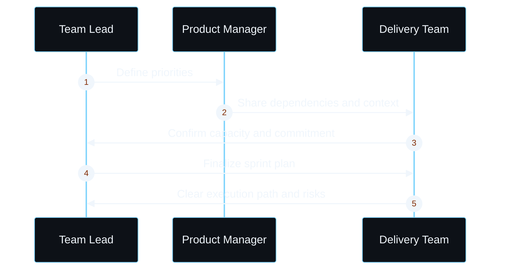
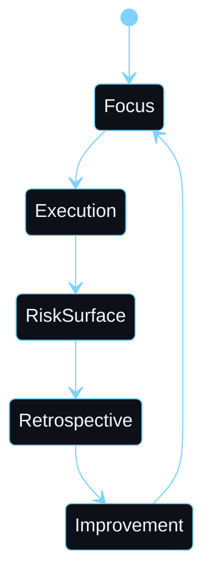

<div align="center">

  

  <p style="margin-top: 22px; margin-bottom: 8px; color: #f0f6fc; font-size: 18px; letter-spacing: 0.18em; text-transform: uppercase; font-weight: 700;">
    Delivery Leadership
  </p>

  <p style="margin: 0; color: #8b949e; font-size: 15px; font-family: monospace;">
    Strategic clarity. Team enablement. Measurable execution.
  </p>

</div>

## Overview

I connect business strategy to team execution through structured clarity. Before work begins, I align priorities, dependencies, ownership, and success criteria so delivery can move with confidence and minimal friction.

```mermaid
%%{init: {'theme': 'base', 'themeVariables': { 'fontFamily': 'Segoe UI, Arial, sans-serif', 'primaryColor': '#0d1117', 'primaryTextColor': '#f0f6fc', 'primaryBorderColor': '#7dd3fc', 'lineColor': '#7dd3fc', 'secondaryColor': '#161b22', 'tertiaryColor': '#0d1117', 'background': '#0d1117'}}}%%
flowchart TD
    A[Current state] -->|diagnose| B[Gap analysis]
    B -->|align| C[Goal clarity]
    C -->|enable| D[Ownership model]
    D -->|track| E[Progress & risk visibility]
    E -->|refine| F[Delivered outcomes]

    classDef node fill:#161b22,stroke:#7dd3fc,stroke-width:1.5px,color:#f0f6fc;
    classDef end fill:#0d1117,stroke:#7dd3fc,stroke-width:1.5px,color:#7dd3fc;
    class A,B,C,D,E node;
    class F end;
```

---

## Core Delivery Practice

### Strategic Clarity & Planning

Teams often start execution without shared understanding of priorities, dependencies, or success metrics. I bring structure to planning so the work is aligned before sprint commitments are made.



### Team Enablement & Sustainable Pace

The challenge is not only delivery speed, but sustainable execution. I support teams with coaching, process discipline, and a working environment where risk is raised early instead of hidden.



### Delivery Visibility & Reporting

Leadership needs more than progress updates. It needs evidence, a clear risk picture, and decisions grounded in real execution data.

| Phase | Status | Purpose |
| --- | --- | --- |
| Goals set | Aligned | Briefs establish scope, outcomes, and ownership |
| Execution | Active | Work proceeds with clear priorities and decisions |
| Risk surface | Visible | Blockers, dependencies, and escalations are surfaced early |
| Mitigation | Managed | Actions reduce drag and restore momentum |
| Delivery | Confirmed | Outcomes are measured against the original intent |

---

## Leadership Practice Stack

<table width="100%" style="border-collapse: collapse; background: #0d1117; border: 1px solid #30363d; margin-top: 18px;">
  <tr style="background: #161b22;">
    <th align="center" style="padding: 18px; color: #7dd3fc; width: 33%; border-bottom: 1px solid #30363d;">Strategic Planning</th>
    <th align="center" style="padding: 18px; color: #7dd3fc; width: 34%; border-bottom: 1px solid #30363d;">Team Enablement</th>
    <th align="center" style="padding: 18px; color: #7dd3fc; width: 33%; border-bottom: 1px solid #30363d;">Delivery Outcomes</th>
  </tr>
  <tr>
    <td align="center" valign="top" style="padding: 20px 12px; border-right: 1px solid #30363d; color: #f0f6fc;">
      <div style="font-size: 30px; margin-bottom: 10px;">•</div>
      Sprint planning<br/>
      Dependency mapping<br/>
      Governance clarity
    </td>
    <td align="center" valign="top" style="padding: 20px 12px; border-right: 1px solid #30363d; color: #f0f6fc;">
      <div style="font-size: 30px; margin-bottom: 10px;">•</div>
      Coaching and mentoring<br/>
      Process improvement<br/>
      Team resilience
    </td>
    <td align="center" valign="top" style="padding: 20px 12px; color: #f0f6fc;">
      <div style="font-size: 30px; margin-bottom: 10px;">•</div>
      Visibility and reporting<br/>
      Risk management<br/>
      Measurable progress
    </td>
  </tr>
</table>

---

<div align="center" style="padding: 30px 0 12px;">
  <sub style="color:#8b949e; font-family: monospace;">Execution with clarity. Delivery with visibility.</sub>
</div>
