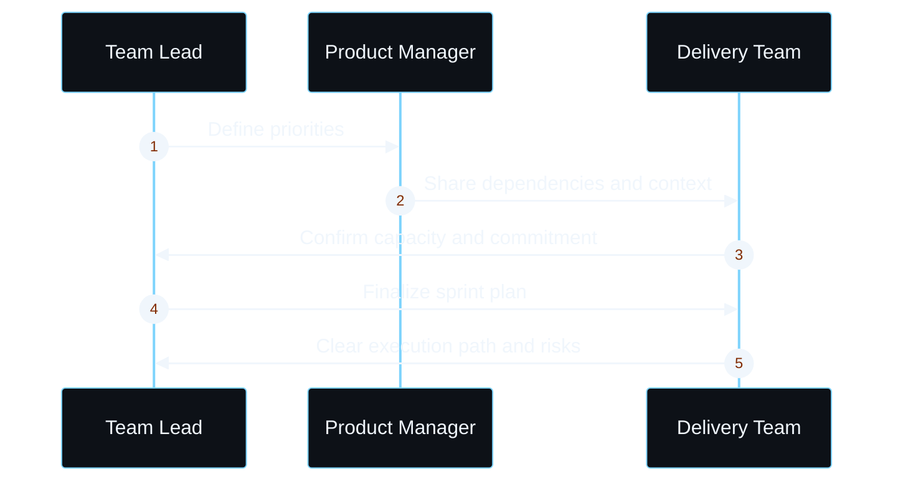
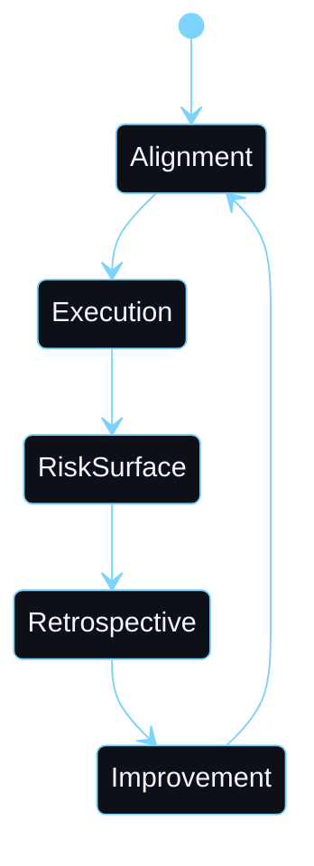

  <h1 style="margin: 0 0 10px 0; color: #7dd3fc; font-size: 28px; letter-spacing: 0.1em; font-weight: 700; text-transform: uppercase;">
    Deven Kashyap
  </h1>

  

    DELIVERY LEADERSHIP & EXECUTION
  

  

    Strategy into execution. Clarity before commitment.
  

---

## Overview

I connect business strategy to team execution through structured clarity. Before work begins, I align priorities, dependencies, ownership, and success criteria so delivery can move with confidence and minimal friction.

---

## Core Practice

### Strategic Clarity & Planning

Teams often begin execution without shared understanding of priorities, dependencies, or measurable success criteria. I establish planning discipline before sprint commitments are made.

### Team Enablement & Sustainable Pace

The challenge is not only speed, but sustainable execution. I support teams with coaching, process discipline, and an environment where risk is raised early instead of hidden.

### Delivery Visibility & Reporting

Leadership needs actionable intelligence, not activity reports. Evidence-based communication connects daily execution to business outcomes, surfaces risks early, and enables decisions grounded in reality.

| Phase | Status | Purpose |
| --- | --- | --- |
| Goals set | Aligned | Scope, outcome, and ownership are explicit |
| Execution | Active | Work proceeds with a clear decision path |
| Risk surface | Visible | Blockers and dependencies are surfaced early |
| Mitigation | Managed | Escalation and action restore momentum |
| Delivery | Confirmed | Outcomes are measured against original intent |

---

## Leadership Practice Stack

| **Strategic Planning** | **Team Enablement** | **Delivery Outcomes** |
| :--- | :--- | :--- |
| Sprint facilitation & governance | Coaching & continuous improvement | Transparent reporting & risk visibility |
| Dependency mapping & prioritization | Process discipline & decision frameworks | Evidence-based communication |
| Ownership clarity & accountability | Psychological safety & resilience | Business outcome measurement |

---

  Execution with clarity. Delivery with visibility.

